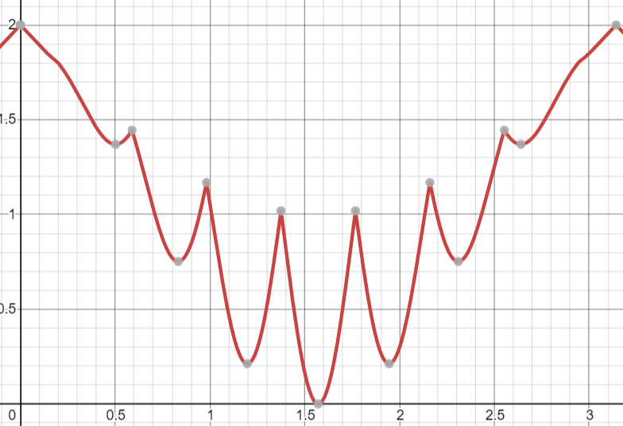

# Konkurrens Beadandó

Fordításhoz és futtatáshoz használd a ```make``` és ```make run``` parancsokat.

Az vendégek egy sin és cos függvényekből álló formula segítségével reprezentálom, mellyel tökéletesen lehet imitálni a csúcsidőket.

Zárási időben ezt a formulát egy 10-es szorzóval bővítem, hiszen zárási időn kívül azért mégiscsak kevesebben próbálkoznak fodrászhoz menni.

Az időt nem én nullázom, hanem felhasználom a java.util.Date osztályt és azt a modulo segítségével fordítom le az álltalunk definiált napi időintervallumra (new Date().getTime() % 9600).


## Látogatottsági mutató

A látogatói gráfot könnyen meglehet nézni a https://www.desmos.com/calculator segítségével.

Formula:

```2-\left(\left|\sin\left(x\right)\right|\cdot\left|\cos\left(8x\right)\right|+1\right)\cdot\left|\sin\left(x\right)\right|```

vagy

```2 - (|sin(x)| * |cos(8x)| + 1) * |sin(x)|```



Végül pedig van hozzáadva némi randomitás és felskálázás, illetve az elején említett "éjszakai" 10-es szorzó.

Utolsó magyarázatként pedig még annyi, hogy a ```"2 -"``` azért van az elején, hogy minél magasabb látogatottságra minél kisebb sleep-et kelljen meghívni.